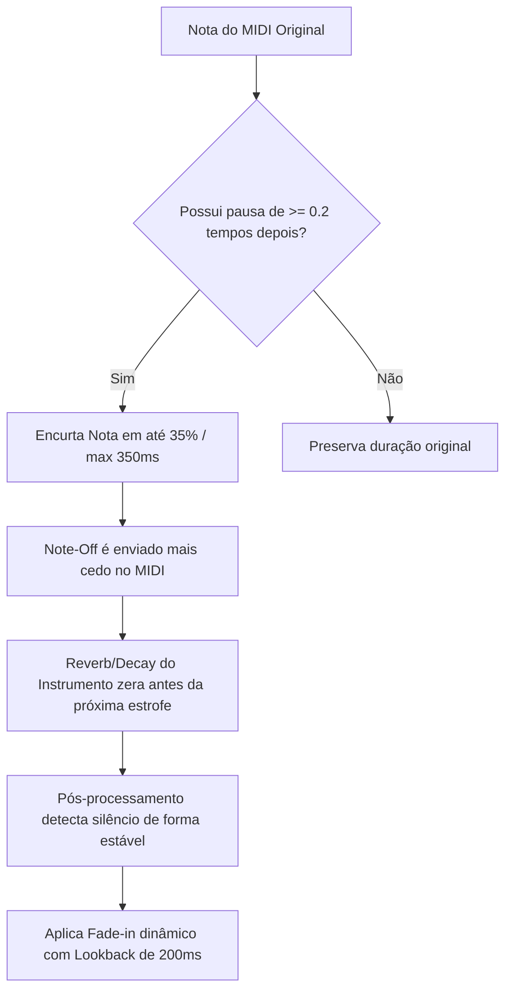

# 🎼 Sistema de Orquestração Inteligente para Hinos (MuseScore 4 & DDSP)

Este repositório contém um ecossistema completo para orquestração automática e humanização de arquivos MIDI (SATB - Soprano, Contralto, Tenor, Baixo). Ele se integra ao **MuseScore 4 CLI (Muse Sounds)** e a modelos **DDSP (Differentiable Digital Signal Processing)** para gerar áudios finais com qualidade orquestral e alta expressividade.

---

## 🗺️ Mapa do Repositório (Estrutura de Arquivos)

Aqui está a descrição de cada arquivo principal do sistema e seu respectivo papel:

### 🎻 Orquestração de Cordas (Strings)
*   **[musescore_strings_16part.py](file:///Volumes/Dados/work/ia-music/musescore_strings_16part.py)**: O motor de cordas mais avançado. Divide o coral SATB tradicional em **16 partes independentes** (4 instrumentos por voz/naipe) com base em presets acústicos e pans espaciais.
*   **[musescore_strings_math.py](file:///Volumes/Dados/work/ia-music/musescore_strings_math.py)**: Orquestrador clássico de 4 naipes de cordas com controle e curvas matemáticas em CC11.

### 🎺 Orquestração de Metais (Brass)
*   **[musescore_orchestrate_math.py](file:///Volumes/Dados/work/ia-music/musescore_orchestrate_math.py)**: Orquestrador matemático que mapeia vozes para naipes de metais (Trumpet, Trombone, French Horn, Tuba). Aplica curvas de expressão baseadas na física dos metais.
*   **[musescore_orchestrate.py](file:///Volumes/Dados/work/ia-music/musescore_orchestrate.py)**: Versão alternativa de orquestração geral para MuseScore.

### 🔬 Processamento de Áudio e Integração
*   **[postprocess_fade_apos_pausa.py](file:///Volumes/Dados/work/ia-music/postprocess_fade_apos_pausa.py)**: Script de pós-processamento de áudio digital. Aplica envelopes de ganho cúbicos (`smoothstep`) em respiros/pausas para eliminar transientes secos (*clicks* de arco).
*   **[run_batch_strings.py](file:///Volumes/Dados/work/ia-music/run_batch_strings.py)**: Pipeline principal automatizado. Orquestra, renderiza áudio, pós-processa e organiza a pasta de saída limpa em lote para centenas de hinos.
*   **[ddsp_orchestrate.py](file:///Volumes/Dados/work/ia-music/ddsp_orchestrate.py)**: Orquestrador alternativo que sintetiza os instrumentos utilizando redes neurais DDSP em vez da engine de áudio do MuseScore.
*   **[orchestrate.py](file:///Volumes/Dados/work/ia-music/orchestrate.py)**: Orquestrador básico para SoundFonts MIDI.

---

## 🎺 1. A Orquestra de Metais (Brass)

O arquivo **[musescore_orchestrate_math.py](file:///Volumes/Dados/work/ia-music/musescore_orchestrate_math.py)** gerencia a orquestra de metais. A pasta **[brass](file:///Volumes/Dados/work/ia-music/brass)** abriga os áudios resultantes desse processo.

*   **Configuração Física**: Metais exigem ataques firmes, mas dinâmica contínua. O mapeamento clássico direciona:
    *   **Soprano** ➔ *Trumpet* (Brilhante e cortante).
    *   **Contralto** ➔ *French Horn* (Encorpado e aveludado).
    *   **Tenor** ➔ *Trombone* (Robusto e ressonante).
    *   **Baixo** ➔ *Tuba* (Sustentação grave).
*   **Modelagem de Expressão**: A curva dinâmica é calculada por modulação de pressão de ar virtual, mantendo os timbres de metais bem integrados e balanceados dinamicamente.

---

## 🎻 2. A Orquestra de Cordas (16 Parts Strings)

O script **[musescore_strings_16part.py](file:///Volumes/Dados/work/ia-music/musescore_strings_16part.py)** realiza um processamento avançado dividindo cada uma das 4 vozes corais (SATB) em **4 divisões independentes** (totalizando 16 partes):

1.  **Divisão Estéreo e Pan (Espacialização)**: Os instrumentos são dispostos horizontalmente no palco virtual (ex.: Violinos 1 e Solo no lado esquerdo; Violoncelos e Contrabaixos centralizados ou à direita).
2.  **Modificadores de Volume de Timbres (RMS Normalizado)**: Devido à discrepância de volume nativa da biblioteca *Muse Sounds* (onde Contrabaixos abafam Harpas, por exemplo), aplicamos uma normalização baseada em medição RMS real:
    *   *Violins*: `1.0` (Referência)
    *   *Violas*: `0.68` (Atenuadas)
    *   *Violoncellos*: `0.74` (Atenuados)
    *   *Contrabasses*: `0.44` (Atenuados para não sobrecarregar os graves)
    *   *Harp*: `1.93` (Amplificada para ter clareza nas dedilhadas do Soprano)
3.  **Destaque Dinâmico por Frase**: A cada 4 compassos, um naipe recebe ganho de **+15%** enquanto os outros são atenuados em **-10%**, imitando a regência humana que destaca o tema melódico em rotação (Soprano ➔ Contralto ➔ Tenor ➔ Baixo).
4.  **Duplicação Avançada de Oitavas**: No último verso (clímax), o Soprano é oitavado com Violinos à esquerda, e o Tenor é oitavado com Violas à direita, expandindo a massa sonora.

---

## 🌬️ 3. O Sistema de Pausas (Humanização e Respiro)

Para contornar limitações físicas do sintetizador *Muse Sounds* (que gera estalos mecânicos de arco no início das notas ou embola o final de frases devido à ressonância infinita), desenvolvemos um sistema duplo de silenciamento e ataque suave:



### A. Encurtamento de Notas Pré-Pausa (No MIDI)
Quando uma nota precede um silêncio (pausa $\ge 0.2$ tempos):
*   Sua duração é reduzida em **até 35% (limite de 350ms)**.
*   Isso força o disparador de *Note-Off* a ocorrer mais cedo, dando tempo para o release físico e o reverb do instrumento decaírem completamente, criando um **respiro/silêncio real** na estrofe.

### B. Ataque Suave pós Pausa (Controle CC1 e Velocity)
Em notas que iniciam logo após uma pausa:
*   A **Velocity** inicial do note-on é forçada a **10** (acionando a articulação mais leve do instrumento, eliminando o clique do arco).
*   A rampa de dinâmica é enviada via **CC1 (Modulação de Pressão)** em vez de CC11, subindo linearmente de **1.0** a **127** nos primeiros **250ms** da nota em alta resolução (passos de 10ms).

### C. Lookback no Pós-Processamento de Áudio (No MP3)
Para suavizar transientes remanescentes no áudio:
*   O script **[postprocess_fade_apos_pausa.py](file:///Volumes/Dados/work/ia-music/postprocess_fade_apos_pausa.py)** detecta os pontos de resumos após pausas.
*   **lookback-ms (200ms)**: A curva de fade-in no áudio inicia **200ms antes** do fim do silêncio detectado (dentro da zona de silêncio absoluto).
*   Isso impede cortes secos de volume na cabeça das notas, realizando uma abertura suave via curva cúbica Hermitiana (`smoothstep`).

---

## 🚀 4. Executando o Pipeline Completo

O script **[run_batch_strings.py](file:///Volumes/Dados/work/ia-music/run_batch_strings.py)** automatiza todo o fluxo acima para todos os arquivos da pasta **[mid](file:///Volumes/Dados/work/ia-music/mid)**.

### Preparação do Ambiente:
```bash
conda activate ddsp
```

### Executando em Lote:
Rode o script na raiz do projeto:
```bash
python run_batch_strings.py
```

### Fluxo de Trabalho do Script:
1.  Lê os arquivos MIDI de `mid/*.mid`.
2.  Chama o orquestrador de 16 partes (grava arquivos intermediários em uma pasta temporária `temp_orchestra`).
3.  Executa o pós-processamento de suavização acústica nos MP3s com lookback de 200ms.
4.  Copia os arquivos finais suavizados para a pasta **`string/`** com o **mesmo nome do arquivo MIDI original**.
5.  Limpa todos os arquivos temporários criados no processo.
